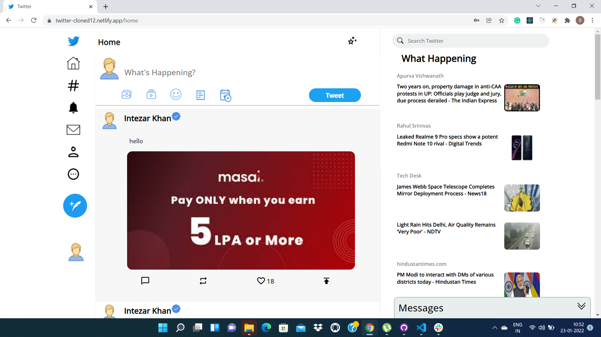

# UpGrad - Clone

>It is a clone of twitter.com. We used HTML, JavaScript, Tailwind CSS, Mongo DB, and Express JS in this Project. We implement features like login, Sign up, Real time chat and posting a tweet.

## Hosted Platform

https://twitter-cloned12.netlify.app/

## Contributors

1. Gurdeep Singh
2. Sushan Salvi
3. Intezar Khan
4. Abhishek Singh
5. Gaddam Jaswanth

## Technologies Used
> &ensp;     
> &ensp; 
> &ensp; 
> &ensp; 
> &ensp; 

## Backend Repository
https://github.com/gurdeep7/twitter-backend

## Snapshot from the Built Project

  &emsp; &emsp;
<ul>
  <li>Sign-Up Page: User details stored to server by using mongodb.conneting by useing API calls</li>
  <li>Sign-Up  page: It will checkDeatails of all users and Name will only unic then only it aloow to access to Twitter.</li>
  <li> Sign-Up  page: Users have to match the passward of two Slots.</li>
  <li>Sign-Up  page: Mail have to Unic</li>
</ul>

  
 <ul>
  <li>Sign-In Page: It check the email and passworsd.By using email validations and sanitizering password</li>
  <li>Sign-In  page: If they are correct deatals.Then only allows to user.</li>
  
</ul>
   &emsp;
  <ul>
  <li>Home Page: There you can see new feed. Related data like sports and upcoming events and etc.. </li>
  <li>Home Page:By clicking on tweet there user can add images and reaction like emoji. they can tweet what have in mind</li>
 </ul>
  
  &emsp;
    <ul>
  <li>Chat  Page: Chat page is buld by using websockets </li>
  <li>Chat Page:It is just like group chat. in there we have to chat all members in group </li>
 <li>Chat Page: while chating sender name is also there </li>
 </ul>
  
  &emsp; 

